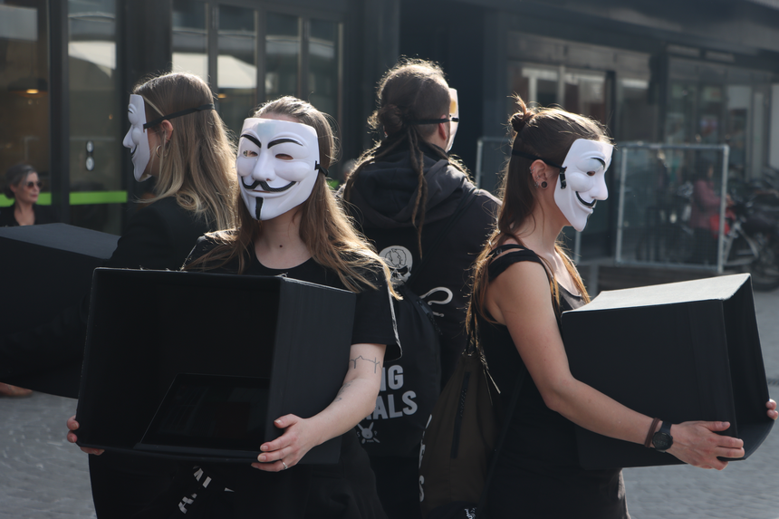
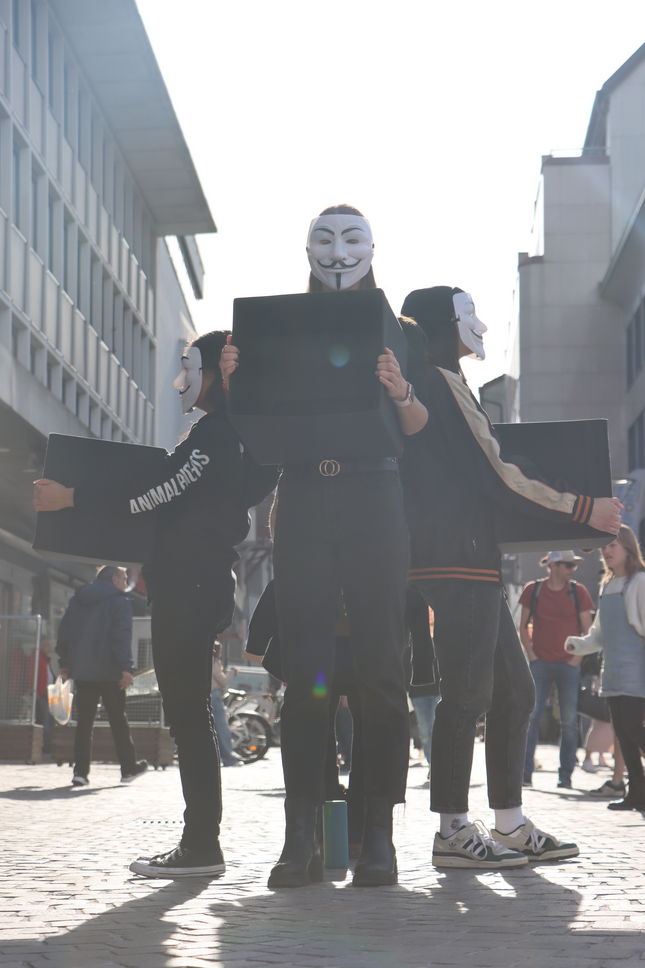

# Cube Guide
Aktivismus für die Rechte der Tiere in der Schweiz.

# Unsere Werte
- Wir setzen uns für die Rechte der Tiere ein
- Unser Aktivismus ist friedlich und legal
- Unsere Gespräche haben immer die vegane Lebenseinstellung zum Ziel
- Wir tolerieren von unseren teilnehmenden Aktivist\*innen kein diskriminierendes, belästigendes oder anderweitig respektloses Verhalten

## Our values
- We engage ourselves for animal rights
- Our activism is peaceful and legal
- Our conversations always lead to a vegan lifestyle
- We do not tolerate any discriminatory, harassing or otherwise disrespectful behaviour from our participating activists

# Der Cube
- Personen im Viereck bilden den “Cube”
- Bildschirme zeigen Aufnahmen aus der Schweizer Tierindustrie und aus dem Dokumentarfilm Dominion
- Interessierte Passant\*innen halten an und werden von “Outreachers” angesprochen
- Personen im Cube und im Outreach tauschen regelmässig die Plätze

## The cube
- People in a square form the "cube"
- Screens show footage from the Swiss animal industry and from the documentary film Dominion
- Interested passers-by stop and are approached by "outreachers"
- People in the cube and in outreach regularly swap places

# Auf den Cube vorbereiten
- Lies unseren [OUTREACH GUIDE](./outreach.html)
- Lade das Video herunter: [VIDEO HERUNTERLADEN](https://drive.google.com/uc?id=1d5qn27noY-JxSZWIbTCMe429KWJ7F6_C&export=download)
  - Teste das Video in der Endlosschleife (bsp. mit [VLC](https://www.videolan.org/vlc/index.de.html))
- Notebook/Tablet laden und mitbringen
- Trage schwarze/möglichst dunkle Kleidung
- Nimm wenig Gepäck mit

## Preparing for the cube
- Read our [OUTREACH GUIDE](./outreach.html)
- Download the video: [VIDEO DOWNLOAD](https://drive.google.com/uc?id=1d5qn27noY-JxSZWIbTCMe429KWJ7F6_C&export=download)
  - Test the video in an endless loop (e.g. with [VLC](https://www.videolan.org/vlc/index.de.html))
- Charge your notebook/tablet and bring it with you
- Wear black/mostly dark clothing
- Take just few items with you

# Am Cube teilnehmen
- Nimm am Briefing teil
  - Zu Beginn erfährst du wie der Cube funktioniert
  - Offene Fragen werden beantwortet
- Steh im Cube oder führe Gespräche - beides ist wertvoll!
  - Noch nicht bereit für Gespräche? Lies unseren [OUTREACH GUIDE](./outreach.html)
- Masken, Schilder und Visitenkarten werden zur Verfügung gestellt
- Teilnahme an der gesamten Aktion gewünscht - ist aber keine Pflicht
  - Nach dem Cube gehen wir gemeinsam essen/trinken, nicht verpassen! 😉

## Participating in the cube
- Partake in the briefing
  - The cube is explained at the beginning
  - Open questions are answered
- Stand in the cube or have conversations - both is crucial!
  - Not ready for conversations yet? Read our [OUTREACH GUIDE](./outreach.html) 
- Masks, signs and closing cards are provided
- Participating in the complete activity is desired - but not required
  - After the cube we’ll grab some food/drinks, don’t miss it! 😉

# Auf dem Laufenden bleiben
- Signal/WhatsApp Gruppe beitreten für Terminbenachrichtigungen
  - Frag das Organisationsteam am Cube nach einer Einladung
- Feedback? [Schreib uns](https://forms.gle/QW3ZR9RHvbV6vThf9)
- Alle weitere Ressourcen und Termine findest du [hier](/#join)

## Stay in touch
- Join our Signal/WhatsApp group for cube notifications
  - Ask the organisation team at the cube for an invitation
- Feedback? [Let us know](https://forms.gle/QW3ZR9RHvbV6vThf9)
- All further resources and events can be found [here](/#join)
