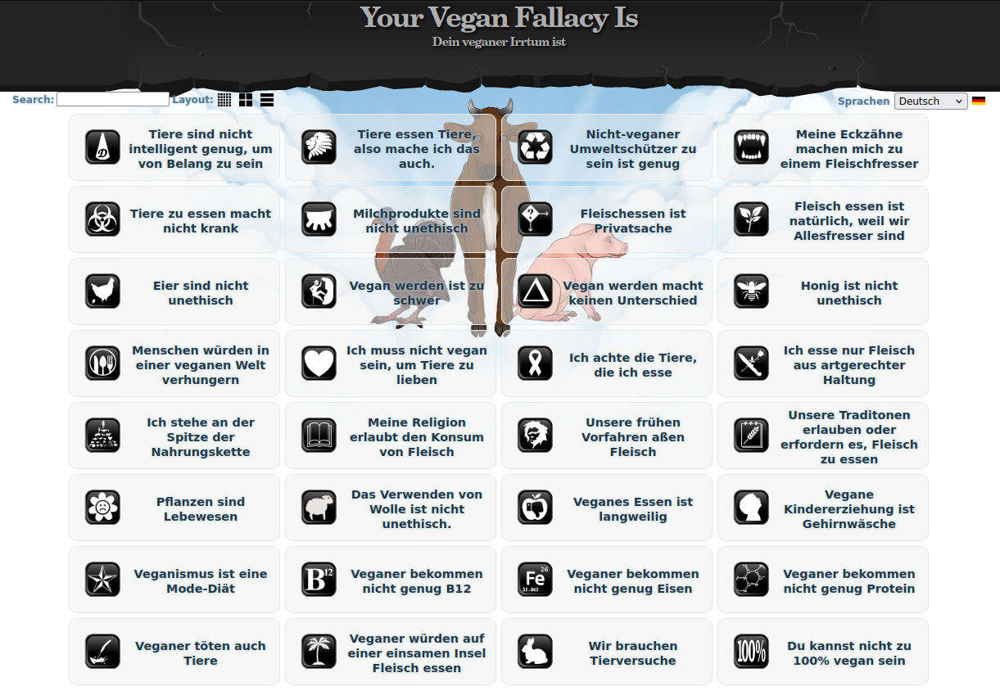
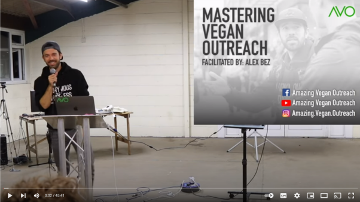
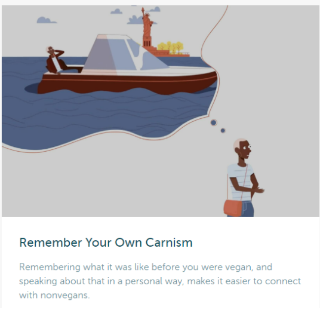

# Outreach Guide
Eine Hilfestellung zur Gesprächsführung für Menschen im Aktivismus.

# Inhaltsverzeichnis
- [Vorwort](#vorwort)
- [Unser Standpunkt im AARS Outreach](#unser-standpunkt-im-aars-outreach)
- [Aufbau & Ziel eines Gespräches](#aufbau--ziel-eines-gespräches)
   * [Erste Frage](#erste-frage)
   * [Diskussion](#diskussion)
      + [Erklärungen](#erklärungen)
      + [Deine Geschichte](#deine-geschichte)
      + [Argumenten entgegnen](#argumenten-entgegnen)
      + [Veganismus als Teil der Ethik](#veganismus-als-teil-der-ethik)
      + [Deeskalation](#deeskalation)
      + [Geschichte der Passanten](#geschichte-der-passanten)
   * [Abschluss](#abschluss)
- [Empfohlene Outreach Ressourcen](#empfohlene-outreach-ressourcen)
   * [Häufige "Argumente" von Omnivoren](#häufige-argumente-von-omnivoren)
   * ["Outreach like a pro"](#outreach-like-a-pro)
   * [Center for Effective Vegan Advocacy](#center-for-effective-vegan-advocacy)
- [Weitere Tipps zur Gesprächsführung ](#weitere-tipps-zur-gesprächsführung)
   * [Effizienz](#effizienz)
   * [Körpersprache / Psychologie](#körpersprache--psychologie)
   * [Fragetechniken](#fragetechniken)
   * [Offene Fragen zur Gesprächsführung](#offene-fragen-zur-gesprächsführung)
   * [Fragen zum Festigen der Konversation](#fragen-zum-festigen-der-konversation)
   * [Die Defensive durchbrechen](#die-defensive-durchbrechen)
- [Nachwort](#nachwort)

# Vorwort
Liebe aktive Menschen,

Wir freuen uns, dass du bei uns gelandet bist!
Dieser Outreach Guide soll lediglich als Hilfestellung dienen, speziell zu Beginn. Du wirst merken, dass du mit der Zeit deinen eigenen Stil entwickeln wirst und wie du am besten auf dein Gegenüber eingehen kannst.

Wir nutzen die sokratische Art, ein Gespräch zu führen und empfehlen, immer auf Augenhöhe mit dem Gegenüber zu sprechen.

Wir wünschen dir viel Erfolg beim einlesen und bei Unklarheiten darfst du dich auch gerne an uns oder andere erfahrene Aktivist\*innen wenden!

# Unser Standpunkt im AARS Outreach
- Wir haben eine abolitionistische Haltung, d.h. jegliche Art der Ausbeutung von Tieren ist nicht in Ordnung.
- Wir fokussieren uns nicht darauf, wie es den Menschen einfacher gemacht werden kann, vegan zu leben. Wir verkaufen den Veganismus nicht als eine Diät, die man ausprobieren kann. Es geht um eine Ungerechtigkeit und es geht um die Opfer dahinter.
- Wir fokussieren uns mehr auf das “Warum” und weniger auf das “Wie”.
- Die Menschen können unsere Informationen annehmen, was sie letztendlich damit machen, ist ihnen selbst überlassen.
- Wir ziehen die Leute in die Verantwortung und machen ihnen klar, dass die Tiere wegen Leuten leiden müssen, die nicht vegan leben.

# Aufbau & Ziel eines Gespräches
Ein Gespräch im Outreach hat zum Ziel, dass die Passanten informiert werden und sie selber ihren Konsum hinterfragen. Hierzu verwenden wir das Bildmaterial des Cubes und ein gut strukturiertes Gespräch als Instrumente. Es geht nicht darum, andere Menschen zu "überreden" oder deren Verhalten zu “verändern”, sondern die Problematik zu zeigen und die Menschen dazu motivieren, aus intrinsischer Motivation vegan zu werden. Dazu braucht es Outreach-Gespräche, die effizient, empathisch und respektvoll geführt werden.

Ein Gespräch im Outreach hat folgende Struktur:
- Erste Frage
- Diskussion
- Abschluss

Nachfolgend sind die verschiedenen Teile des Gesprächs näher beschrieben.

## Erste Frage
Nachdem die Passanten aufmerksam in den Cube geschaut haben, sprichst du sie mit einer ersten Frage an. Zum Beispiel: “Guten Tag. Haben Sie schon mal so etwas gesehen?”. Typischerweise antworten die Leute mit: “Ja, in der Schule/auf Social Media, im TV…” oder “Nein, noch nie…”.

Die Frage soll eigentlich nur dazu dienen, mit der Person ins Gespräch zu kommen. Du kannst an dieser Stelle direkt in die Diskussion einsteigen mit: “Dann sind Sie vielleicht etwas vertraut mit den Dingen, die wir hier zeigen…”, sofern die Antwort “ja” war oder du machst direkt weiter, wenn die Antwort “nein” war.

## Diskussion
Im Hauptteil des Gespräches springst du inhaltlich zwischen diesen verschiedenen Punkten: Erklärungen, deiner Geschichte, “Argumenten” entgegnen, Veganismus als Ethik, Deeskalation, Geschichte der Passanten.

Die Reihenfolge kann variieren, es kommt immer darauf an, mit wem ein Gespräch geführt wird. Nach der ersten Frage beginnst du meistens mit den Erklärungen. Vielleicht erzählst du dann deine Gesichte, entgegnest ein paar “Argumenten”, erklärst Veganismus als Teil der Ethik und dann kommt das Gespräch zum Abschluss.

### Erklärungen
Du erklärst, was im Filmmaterial eigentlich gezeigt wird. Beispielsweise:
- Die Kälber werden von der Mutter getrennt und angekettet wegen dem “zarten” Kalbfleisch.
- Diese Schweine leben auf kleinstem Raum und entwickeln oft schmerzhafte Krankheiten.
- Dieser Schlachtprozess entspricht dem Standard der Industrie gemäss Schweizerischem Tierschutzgesetz: Die Person verwendet einen Bolzenschuss am Schädel der Kuh und dann schneiden sie ihnen den Hals auf.

Eine Erklärung hat zum Ziel, dass die Passanten die systematische Ausbeutung der Tiere sehen. Weiter aber, machst du mit einem Satz wie “... das alles passiert nur, weil wir Tiere essen” den Passanten klar, dass unser Konsumverhalten hier matchentscheidend ist. Auch wenn du natürlich vegan bist, hilft es, von “wir” zu sprechen. Das signalisiert den Passanten, dass wir gemeinsam gegen die Ausbeutung von Tieren stehen.

Typischerweise sind die Passanten danach geschockt und reagieren entweder mit “Argumenten” bzw. Ausreden wie “das ist in meinem Dorf nicht so” oder sagen noch nichts. Nach einer Erklärung kannst du deshalb entweder “Argumenten” entgegnen oder mit deiner Geschichte fortfahren.

### Deine Geschichte
In diesem Teil der Diskussion machst du deinen Outreach persönlich und greifbarer für die Passanten. Gleichzeitig zeigst du, indem du über deinen Gedankengang sprichst, die eigentliche Logik hinter dem Veganismus. Die Passanten ziehen bewusst oder unbewusst Parallelen zu ihrem Konsum, ohne dafür sich wie an den Pranger gestellt zu fühlen. Deine Geschichte kann beispielsweise so klingen:

*“Ich habe solche Aufnahmen auch mal auf YouTube gesehen. Ich war ehrlich gesagt ziemlich schockiert, damals war ich nicht vegan. Ich dachte, wie kann es sein, dass Tiere für mich so behandelt werden? Ich habe eigentlich schon immer Tiere gemocht. Wir hatten immer Hunde und Katzen als Haustiere in der Familie. Das fühlte sich für mich nicht mehr richtig an und ich konnte nicht mehr Fleisch essen. Dann fing ich an mich zu informieren und fand heraus, dass die Milch- und Eierproduktion nicht besser sind als Fleisch. Deshalb wurde ich dann vegan.”*

An diesem Punkt reagieren die Passanten typischerweise mit “Argumenten”, mit Fragen oder vielleicht mit ihrer eigenen Geschichte. Du führst das Gespräch entsprechend weiter.

### Argumenten entgegnen
Wenn du das hier liest, dann weisst du, dass es keine logischen Argumente gibt, die den Veganismus als ethischen Standpunkt schwächen könnten. Wichtig ist es im Outreach, diese Tatsache im Hinterkopf zu behalten und sich deshalb weder aus der Ruhe bringen zu lassen, noch in eine “Debatte” einzugehen. Das soll nicht arrogant wirken, viel mehr nimmst du die Passanten an der Hand und führst sie etwas sanfter zu diesem wichtigen Thema.

Wenn die Passanten beispielsweise sagen: “Die Löwen essen aber auch andere Tiere!”, dann bleib für einen Moment ruhig. Atme durch. Du kannst dann ruhig antworten:

*“Wissen Sie, früher habe ich mir solche Gedanken auch gemacht und ich höre diese Aussage ziemlich oft. Ich denke vielmehr, dass ich als Person immer entscheiden kann, ob ich heute bei meiner Mahlzeit ein Tier töte oder nicht. Ein Löwe kann das nicht, glaube ich. Ich fühle mich nicht wohl dabei, Tiere unnötig zu töten, es muss ja nicht sein. Sich pflanzlich zu ernähren ist zudem auch gesund.”*

Im Grunde genommen hat deine Antwort in diesem Stil Folgendes erreicht: die Person fühlt sich nicht als “dumm” betitelt (*“früher habe ich mir solche Gedanken auch gemacht”*), du präsentierst den eigentlich logischen Gedanken mit Bezug auf deine eigene Person (*“...ich als Person immer entscheiden kann, ob ich heute bei meiner Mahlzeit ein Tier töte oder nicht.”*) und du hast die Person mit anderen Fakten vertraut gemacht (*“Sich pflanzlich zu ernähren ist zudem auch gesund.”*). Wichtig ist auch, dass du Veganismus als ethische Sicht in die Diskussion einbeziehst (*“Ich fühle mich nicht wohl dabei, Tiere unnötig zu töten, es muss ja nicht sein.”*).

Den “Argumenten” der Passanten kann auf diese Art und Weise immer (ja, wirklich immer!) entgegnet werden. Gemäss unseren Erfahrungen im Outreach, schätzen die Passanten diese empathische und respektvolle Art (meist unbewusst) und als Person im Outreach kommt man so praktisch nie in ein Bullshit-Bingo-Gespräch, welches sowieso nie Früchte tragen wird. Es ist wichtig, die "klassischen" Gegenargumente, die für den Veganismus sprechen, zu kennen, deshalb findest du dazu in diesem Dokument weitere Informationen. Jedoch sollten diese möglichst persönlich, nachvollziehbar und in einem respektvollen Ton verpackt werden. In den meisten Fällen reagieren die Passanten auf diese Art mit einem offenen Ohr und unterlassen es, weitere “Argumente” zu bringen. Vielmehr “lernen” die Passanten, dass Veganismus eigentlich Sinn macht und sie lassen die “Waffen” fallen, öffnen sich weiter für das Gespräch.

Wenn du auf “Argumente” hingegen schnell mit anderen Fakten “konterst”, entwickelt sich das Gespräch sehr oft zu einer “Debatte”. Damit suggerierst du den Passanten, dass das, was sie sagen, valide Argumente sind. Die Passanten entwickeln den Eindruck, dass sie sehr erfolgreich gegen einen Veganer*in argumentieren. Für die kognitive Dissonanz ist das gefundenes Fressen. Im Endeffekt werden sie dadurch taub für die vegane Message und das Gespräch wird ziemlich sicher nicht erfolgreich enden.

### Veganismus als Teil der Ethik
Typischerweise lohnt es sich, nachdem über die eigene Geschichte gesprochen oder “Argumenten” entgegnet worden ist, den Veganismus als ethischen Standpunkt zu präsentieren. Dies kann so aussehen:

*“Wissen Sie, beim Veganismus geht es darum, so weit wie möglich den Gebrauch von Tieren in Form von Essen, Kleidung oder anderen Formen auszuschliessen. Vegan zu sein ist für mich keine “Diät”. Ich war früher auch nicht vegan, aber als ich solche Bilder sah, fing ich an, mir Fragen zu stellen. Wenn Sie das hier sehen und es sich für Sie nicht richtig anfühlt, würde ich Ihnen empfehlen, sich mal diesen Dokumentarfilm anzusehen.”*

Wenn du den Passanten gekonnt erklärst, weshalb Veganismus für dich als Teil der Ethik so wichtig ist, erkennen die Passanten die Wichtigkeit dieser Sache und respektieren diese meistens auch.

### Deeskalation
Während einem Gespräch kann es sein, dass du in den Modus einer “Debatte” geräts, ständig die gleichen “Argumente” kommen und sich die Sache im Kreis dreht oder vielleicht sogar Schimpfwörter fallen. In einer solchen Situation muss das Gespräch deeskaliert werden. Das kann so klingen:

*“Es tut mir Leid, aber ich habe den Eindruck, dass unser Gespräch nicht wirklich angenehm ist, weder für mich noch für Sie. Ich bin hier, um Menschen zu informieren, die an dieser Sache interessiert sind. Wenn Sie nicht interessiert sind, ist das für mich auch OK. Ich wünsche Ihnen noch einen schönen Tag.”*

Oder:

*“Ich kann hier natürlich nur von meinen Erfahrungen berichten. Ich war schon in Hühnerställen und habe das Leid gesehen, für mich ist deshalb die vegane Antwort immer besser. Es ist für mich OK, wenn Sie anderer Meinung sind. Ich kann Ihnen noch eine Empfehlung geben, wenn Sie möchten, oder wir können auch das Gespräch hier gleich beenden.”*

Eine solche Art der Deeskalation erlaubt es den involvierten Personen nochmals Abstand zu nehmen und entweder getrennte Wege zu gehen oder sich auf das Wesentliche zu konzentrieren. Ein Gespräch, welches diesen Punkt erreicht hat, ist sehr oft nicht mehr zu retten und muss deshalb lieber beendet werden. Zumindest aber geschieht das auf eine respektvolle Art und vielleicht sind die Passanten so in Zukunft trotzdem offen für ein Gespräch über das Leid der Tiere.

Es ist wichtig, ein Gespräch so zu führen, dass eine Deeskalation erst gar nicht notwendig wird. Dazu musst du als Person im Outreach gekonnt den “Argumenten” entgegnen, wie im anderen Kapitel beschrieben. Unter dem Strich, müssen wir als aktive Menschen immer die Verantwortung für das Gespräch übernehmen und dieses gekonnt führen. Klar, manchmal gibt es Passanten, die keinen Respekt zeigen oder jeglicher Outreach irgendwie “nie” ankommt. Vielleicht ist es weder der richtige Ort noch der richtige Zeitpunkt für diese Person, den Veganismus richtig zu verstehen. Das ist auch in Ordnung. Es wird weitere Gespräche geben. Mach einfach weiter.

### Geschichte der Passanten
Nach einigen Erklärungen oder “Argumenten” kann es sein, dass die Passanten von ihrer Geschichte reden. Vielleicht sagen sie etwas wie: “Ich habe mal versucht vegan zu sein, aber ich hatte keine Kraft im Gym” oder “ich bin seit ein paar Monaten vegetarisch, aber auf Käse kann ich nicht verzichten, das ist zu schwer!”.

Im Grunde genommen sind solche Aussagen der Passanten eigentlich “Argumente”, die etwas anders verpackt sind. Irgendwo scheitert es noch, sonst wären sie ja schon vegan. Das ist jedoch ein gutes Zeichen.

Du kannst auf die Geschichte der Passanten eingehen. Stelle Fragen, sei interessiert. Vielleicht kannst du herausfinden, was ihnen Schwierigkeiten bereitet und wo die Hemmschwelle ist. Darauf kannst du mit Anekdoten aus deinen Erfahrungen eingehen. So fühlen sich die Passanten gehört und verstanden.

Nach der Geschichte der Passanten braucht es oft weitere Erklärungen und Inputs aus deiner eigenen Geschichte, wie in den Kapiteln oberhalb beschrieben.

## Abschluss
Die Passanten sind interessiert und das Gespräch ist angenehm verlaufen. Du glaubst, dass die Person interessiert ist, sich weiter zu informieren und es ist Hoffnung da, dass diese Person vegan wird. Du führst dann das Gespräch zu einem Abschluss. Das kann so sein:

*“Ich würde Ihnen gerne eins unserer Kärtchen geben, falls Sie interessiert sind. Für mich persönlich ist dieser Dokumentarfilm von besonderer Bedeutung. Der Film zeigt alles, was mit den Tieren passiert, für verschiedene Produkte wie Fleisch, Milch, Eier, Pelz etc. Das können Sie sich gratis ansehen. Uns kostet es nichts, aber für die Tiere ist das ihr Leben.”*

Der Abschluss eines Gesprächs soll den Passanten einen nächsten kleinen Schritt mit auf den Weg geben. Meistens bedeutet das, dass sie sich einen unserer empfohlenen Dokumentarfilme ansehen. Du kannst aber auch da deinen persönlichen Stil mit einfliessen lassen und den Film oder die Webseite empfehlen, welches zum Gespräch am meisten passt oder für dich besonders wichtig ist. Danach musst du der Sache ihren Lauf lassen. Bester Fall: Sie werden vegan. Schlimmster Fall: Sie hatten ein klärendes Gespräch über den Veganismus.

# Empfohlene Outreach Ressourcen
## Häufige "Argumente" von Omnivoren

Auf [https://yourveganfallacyis.com/de](https://yourveganfallacyis.com/de) findest du häufige “Argumente” der Omnivoren und passende logische Antworten dazu. Es lohnt sich, diese Irrtümer der Passanten zu kennen, um diese, wie in diesem Guide beschrieben, gekonnt zu entschärfen.

Eine ähnliche Webseite ist: [https://www.veganspeak.org/](https://www.veganspeak.org/)

## "Outreach like a pro"

Ein Workshop von Alex Bez mit weiteren Tipps für guten Outreach. Zu finden auf: [https://youtu.be/MxGjxGL2SVo](https://youtu.be/MxGjxGL2SVo)

## Center for Effective Vegan Advocacy

Die renommierte Psychologin Dr. Melanie Joy hat eine Reihe von kurzen Videos auf [https://veganadvocacy.org/videos/](https://veganadvocacy.org/videos/) die gut erklären, wie man effektiv und mit guter Kommunikation den Outreach gestalten kann.

# Weitere Tipps zur Gesprächsführung 
## Effizienz
Gerade bei Gesprächen, bei denen ihr spürt, dass das Gegenüber nicht empfänglich oder interessiert ist, sollten wir nicht verbissen daran festhalten. Manchmal ist es besser, ein Gespräch an dieser Stelle zu beenden - vergiss nicht, dass wir nie alle Menschen erreichen können. Und anstelle von weiterhin zu versuchen, diese Person zu überzeugen, verpassen wir eventuell sogar die Gelegenheit, mit einer offeneren Person ein Gespräch führen zu können.

Mit etwas Übung könnt ihr ein Gespräch so verlaufen lassen, dass ihr das Gespräch nur leitet, euer Gegenüber sollte jedoch euch mitteilen, was falsch ist & wie sie etwas auf individueller Basis daran ändern können.

Ihr solltet auf jeden Fall den Passanten die Gelegenheit geben, sich mitzuteilen und nicht nur mit Informationen zu überwältigen (die Aufnahmekapazität ist ebenfalls begrenzt, auch wenn das Wissen von den meisten von uns enorm sein dürfte - wir können nicht alles an Wissen in einem einzigen Gespräch weitergeben).

Bei einem guten Gespräch könnt ihr dieses auch gerne beenden mit dem Hinweis, dass es sehr interessant war und falls die Person sich vertieft damit auseinandersetzen wird und Fragen dazu auftauchen, darf sie uns gerne über unser Instagramprofil erreichen. Wir werden dort zeitnah Auskunft geben.

## Körpersprache / Psychologie
Auch beim Outreach spielt die Körpersprache eine zentrale Rolle. Es ist empfehlenswert, sich zu dieser Thematik selbst weiteres Wissen anzueignen; einige Tipps können wir dir aber bereits mitgeben:

- Ein freundlicher, aufgestellter Gesichtsausdruck hilft extrem. Finde die Balance zwischen freundlich und seriös, schliesslich ist das Thema auch ernst.
- Stelle dich neben die Person anstatt gegenüber, sodass ihr “gemeinsam” die Videos anschaut.
- Vermeide es, mit gekreuzten Armen da zu stehen. Das ist eine verschlossene Abwehrhaltung.
- Frage am Ende des Gesprächs die Leute, ob Sie nun nach Hause gehen werden und sich eine der Dokumentationen von der Visitenkarte anschauen werden 
(Dies erzeugt im Unterbewusstsein der Passanten, dass sie den Punkt im Gedächtnis auf die To-do-Liste setzen).
- Höre die Passanten mit der Absicht sie zu verstehen und nicht bereits ein Gegenargument auszupacken.

## Fragetechniken
Mit einer Frage wollen wir etwas über die andere Person herausfinden, und ihr nicht auf eine rhetorische Weise unsere Meinung mitteilen. Das wäre nicht sokratisch. Wenn wir unsere Meinung mitteilen wollen, dann sollten wir das einfach machen, ohne dies in einer “Frage” zu verpacken.

Leider passiert das aber ziemlich oft. Wir vegan lebenden Menschen haben eine starke Meinung, sind auf jegliche Argumente vorbereitet und wollen schliesslich etwas bewirken. Gegen Veganismus kann man schlecht gegenargumentieren.

Kontern zu wollen bedeutet, Recht haben zu wollen. Und ja, wir haben recht. Trotzdem hilft das nicht bei der Gesprächsführung. Wir wollen nicht Recht haben, sondern dass das Gegenüber uns zuhört, Informationen aufnimmt und selber anfängt, sich zu hinterfragen.

Das heisst, man sollte mit einer neugierigen Haltung die Perspektive des Anderen erforschen wollen.

Ebenfalls gibt es ein paar Fallen, in welche man treten kann, wenn man Fragen stellt:

- Fragen sollten nicht mit “aber” beginnen. Das Wort “aber” kann mit dem Wort “und” ersetzt werden. So sagt man dem Gegenüber nicht, dass man etwas auszusetzen hat. 
- Wenn eine Frage mit einem Verb anfängt, ist die Wahrscheinlichkeit gross, dass es eine suggestive Frage ist.
- Wenn eine Frage mit “Der, Die oder Das” beginnt, ist es sehr wahrscheinlich eine suggestive Frage.
- Die “Du-Idiot-Frage”: Das ist eine Frage, bei der man am Ende der Frage noch ein “du Idiot” hinsetzen kann, und es macht total Sinn. Ein paar Beispiele:
 - Du weißt zwar nicht, welche Vitamine wichtig sind, aber trotzdem denkst du, man muss tierische Produkte konsumieren (du Idiot)?
 - Wie kannst du Tiere lieben, aber sie trotzdem essen (du Idiot)?
- Warum-Fragen können provozierend wirken, weil man so ziemlich direkt den Anderen hinterfragt. Warum-Fragen können aber umformuliert werden, z.B so:
 - Wie kommst du zum Schluss, dass …
 - Was hat dich dazu gebracht, dass …
 - Welchen Grund hattest du, um …
 - Welches Argument spricht deiner Meinung nach dafür, dass …
- Antworten auf eine Frage können komplex sein. Wenn man die Frage mit “Warum” formuliert, ist die Tendenz da, nur eine Antwort zu geben. Wenn man die Frage mit “Wie” stellt, dann kann die andere Person eine detaillierte Antwort geben.

## Offene Fragen zur Gesprächsführung
Wenn eine Frage mit “Warum” oder “Wieso” beginnt, muss es nicht unbedingt eine offene Frage sein. Es ist dann eine offene Frage, wenn die Antwort nicht unbedingt klar ausfallen kann.

- Wie kommst du zum Schluss, dass Tierquälerei falsch ist?
- Warum passiert das, was du auf den Bildschirmen siehst?
- Wer finanziert diese Gewalt, die du auf den Bildschirmen siehst?
- Wieso denkst du, dass du aktuell keine Tierausbeutung unterstützt?
- Wie kann es sein, dass du aktuell keine Tierausbeutung unterstützt, wenn du dafür zahlst, dass sie sterben?
- Wie kommt es dazu, dass du heute tierische Produkte konsumierst?
- Gibt es eine humane Weise, ein Tier zu töten?
- Was denkst du, ist der Grund, dass eine Kuh Milch produziert?
- Wenn wir etwas in unserer Macht hätten, um dies zu stoppen, denkst du nicht, dass wir das dann tun sollten?
- Glaubst du, es gibt einen Unterschied dazwischen, ob wir einen Hund oder ein Schwein essen?
- Weisst du, wie Tiere aktuell umgebracht werden, wie sieht der Standardprozess aus?
- In welchen Aspekten sind menschliche und nichtmenschliche Tiere gleich oder ähnlich?
- Wie viel Töten von unschuldigen Tieren ist für dich akzeptabel?
- Wie viel Ausbeutung ist für dich akzeptabel?
- Wenn du in einen Laden gehst, und in den Regalen wäre nur Fleisch von glücklichen Hunden, wie würdest du dich fühlen?
- Warum würdest du zulassen, dass der Planet weiter zerstört wird, das unnötige Schlachten von unschuldigen Tieren fortgeführt wird, Kinder weiterhin verhungern und sich deine eigene Gesundheit weiter verschlechtert, wenn es nicht notwendig ist?
- Wenn die “Nutztiere” mit uns Menschen sprechen könnten, was denkst du, würden uns diese Tiere sagen?
- Menschen essen tierische Produkte aus folgenden vier Gründen: Bequemlichkeit, Tradition, Gewohnheit und... Welcher ist es bei dir?

Fasse von Zeit zu Zeit den Standpunkt der Person zusammen, um zu zeigen, dass du Ihre Sicht der Dinge verstanden hast:

“Du sagst also, du isst Fleisch, weil… Und könntest nicht darauf verzichten, weil…”

## Fragen zum Festigen der Konversation
- Denkst du, dass wir tierische Produkte konsumieren müssen?
- Denkst du, dass Tiere, die für unseren Konsum sterben, Opfer sind?
- Bist du gegen das unnötige Töten von Tieren?
- Wenn du die Tierindustrien mit deinem Geld unterstützt und wir dabei an Angebot und Nachfrage denkst, denkst du, dass du damit Tierausbeutung unterstützt?
- Wie definierst du Ausbeutung?
- Denkst du, dass Tiere Leid empfinden können?
- Wirst du hungrig, wenn du solche Aufnahmen siehst? (bei einem Nein-> ist das nicht ein Widerspruch? Würde ein Raubtier davon nicht hungrig werden?/ Warum nicht?- so sieht es aus, wenn dein “Essen” produziert wird)
- Was löst es in dir aus, wenn wir dasselbe mit Hunden/Katzen tun würden? Wo liegt der Unterschied zwischen Hund/Katze und Schwein/Kuh/Lamm etc.

## Die Defensive durchbrechen
- Ich sehe auch, dass der Konsum von tierischen Produkten ein gesellschaftliches Problem ist und die Leute wahrscheinlich deshalb nie die Möglichkeiten hatten, die “Nutztierhaltung” als eine Ungerechtigkeit anzusehen. Bei mir selbst hat es auch xx Jahre gedauert.
- Mir geht es nicht darum, dich als schlechten Menschen darzustellen; mir geht es darum, dass Tiere nicht mehr für den unnötigen Konsum umgebracht werden.
- (Die Konversation kann gegebenenfalls auch auf die emotionale Ebene gewechselt werden) Ich merke, dass unsere Diskussion etwas hitzig wird. Fühlst du dich angegriffen und verurteilt, oder hast du ein schlechtes Gewissen? Falls dem so ist, ist das ein gutes Zeichen. Das zeigt dir auf, dass du es nicht mit dir vereinbaren kannst, was wir nicht-menschlichen Tieren antun. Sich selbst zu verurteilen für die Vergangenheit macht keinen Sinn, man sollte sich darauf konzentrieren, was man ab jetzt verändern kann.
- Mir geht es nicht darum, wie gut du vor mir dastehst, sondern wie gut du vor den Tieren dastehst.
- Ich habe es auch sehr lange nicht gewusst, dass das in der Tierindustrie passiert. Aber es ist leider ein Fakt, wenn du tierische Produkte kaufst, dass du damit andere Menschen bezahlst, dies zu tun, was wir hier auf dem Bildschirm sehen. Deshalb habe ich mich dazu entschieden, vegan zu leben. Wie legitim fändest du es, keine Gewalt mehr mit deinem Geld zu finanzieren?

# Nachwort
Vielen Dank, dass du dir die Zeit genommen hast, dich intensiver mit deinen Outreachskills auseinander zu setzen!

Dieser Guide ist aufgrund von Erfahrung und Zusammentragen mehrerer Personen entstanden. Wenn du weitere wichtige Hinweise hast, darfst du diese selbstverständlich gerne anbringen.

An dieser Stelle gilt es, sich selbst ins Gedächtnis zu rufen, dass wir niemals alle Menschen überzeugen werden können und dass es auch in Ordnung ist, wenn wir uns im Gesprächsverlauf auch mal auf die Umwelt oder Gesundheit konzentrieren. Dennoch sollte die Ethik stets im Vordergrund stehen. 

Wir wünschen dir ganz viel Erfolg und Durchhaltevermögen bei sämtlichen Outreach-Gesprächen.

Dein AARS Team 🙂
