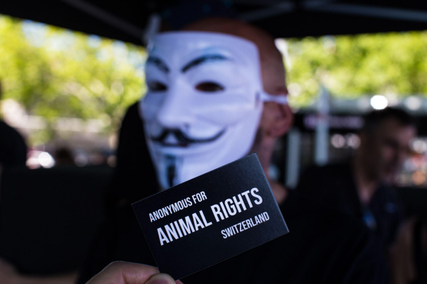

# Outreach Guide
Eine Hilfestellung zur Gesprächsführung für Menschen im Aktivismus.

## Inhaltsverzeichnis
  * [Vorwort](#vorwort)
  * [Unser Standpunkt im AARS Outreach](#unser-standpunkt-im-aars-outreach)
  * [Aufbau & Ziel eines Gespräches](#aufbau---ziel-eines-gespr-ches)
  * [Blah blah](#blah-blah)
    + [Blah blah blah](#blah-blah-blah)
  * [Blah Huh](#blah-huh)
  * [Blah](#blah)

## Vorwort
Liebe aktive Menschen,

Wir freuen uns, dass du bei uns gelandet bist!
Dieser Outreach Guide soll lediglich als Hilfestellung dienen, speziell zu Beginn. Du wirst merken, dass du mit der Zeit deinen eigenen Stil entwickeln wirst und wie du am besten auf dein Gegenüber eingehen kannst.

Wir nutzen die sokratische Art, ein Gespräch zu führen und empfehlen, immer auf Augenhöhe mit dem Gegenüber zu sprechen.

Wir wünschen dir viel Erfolg beim einlesen und bei Unklarheiten darfst du dich auch gerne an uns oder andere erfahrene Aktivist\*innen wenden!

## Unser Standpunkt im AARS Outreach
- Wir haben eine abolitionistische Haltung, d.h. jegliche Art der Ausbeutung von Tieren ist nicht in Ordnung.
- Wir fokussieren uns nicht darauf, wie es den Menschen einfacher gemacht werden kann, vegan zu leben. Wir verkaufen den Veganismus nicht als eine Diät, die man ausprobieren kann. Es geht um eine Ungerechtigkeit und es geht um die Opfer dahinter.
- Wir fokussieren uns mehr auf das “Warum” und weniger auf das “Wie”.
- Die Menschen können unsere Informationen annehmen, was sie letztendlich damit machen, ist ihnen selbst überlassen.
- Wir ziehen die Leute in die Verantwortung und machen ihnen klar, dass die Tiere wegen Leuten leiden müssen, die nicht vegan leben.

## Aufbau & Ziel eines Gespräches
Ein Gespräch im Outreach hat zum Ziel, dass die Passanten informiert werden und sie selber ihren Konsum hinterfragen. Hierzu verwenden wir das Bildmaterial des Cubes und ein gut strukturiertes Gespräch als Instrumente. Es geht nicht darum, andere Menschen zu "überreden" oder deren Verhalten zu “verändern”, sondern die Problematik zu zeigen und die Menschen dazu motivieren, aus intrinsischer Motivation vegan zu werden. Dazu braucht es Outreach-Gespräche, die effizient, empathisch und respektvoll geführt werden.

Ein Gespräch im Outreach hat folgende Struktur:
- Erste Frage
- Diskussion
- Abschluss

Nachfolgend sind die verschiedenen Teile des Gesprächs näher beschrieben.

### Erste Frage
Nachdem die Passanten aufmerksam in den Cube geschaut haben, sprichst du sie mit einer ersten Frage an. Zum Beispiel: “Guten Tag. Haben Sie schon mal so etwas gesehen?”. Typischerweise antworten die Leute mit: “Ja, in der Schule/auf Social Media, im TV…” oder “Nein, noch nie…”.

Die Frage soll eigentlich nur dazu dienen, mit der Person ins Gespräch zu kommen. Du kannst an dieser Stelle direkt in die Diskussion einsteigen mit: “Dann sind Sie vielleicht etwas vertraut mit den Dingen, die wir hier zeigen…”, sofern die Antwort “ja” war oder du machst direkt weiter, wenn die Antwort “nein” war.

### Diskussion
Im Hauptteil des Gespräches springst du inhaltlich zwischen diesen verschiedenen Punkten: Erklärungen, deiner Geschichte, “Argumenten” entgegnen, Veganismus als Ethik, Deeskalation, Geschichte der Passanten.

Die Reihenfolge kann variieren, es kommt immer darauf an, mit wem ein Gespräch geführt wird. Nach der ersten Frage beginnst du meistens mit den Erklärungen. Vielleicht erzählst du dann deine Gesichte, entgegnest ein paar “Argumenten”, erklärst Veganismus als Teil der Ethik und dann kommt das Gespräch zum Abschluss.

#### Erklärungen
Du erklärst, was im Filmmaterial eigentlich gezeigt wird. Beispielsweise:
- Die Kälber werden von der Mutter getrennt und angekettet wegen dem “zarten” Kalbfleisch.
- Diese Schweine leben auf kleinstem Raum und entwickeln oft schmerzhafte Krankheiten.
- Dieser Schlachtprozess entspricht dem Standard der Industrie gemäss Schweizerischem Tierschutzgesetz: Die Person verwendet einen Bolzenschuss am Schädel der Kuh und dann schneiden sie ihnen den Hals auf.

Eine Erklärung hat zum Ziel, dass die Passanten die systematische Ausbeutung der Tiere sehen. Weiter aber, machst du mit einem Satz wie “... das alles passiert nur, weil wir Tiere essen” den Passanten klar, dass unser Konsumverhalten hier matchentscheidend ist. Auch wenn du natürlich vegan bist, hilft es, von “wir” zu sprechen. Das signalisiert den Passanten, dass wir gemeinsam gegen die Ausbeutung von Tieren stehen.

Typischerweise sind die Passanten danach geschockt und reagieren entweder mit “Argumenten” bzw. Ausreden wie “das ist in meinem Dorf nicht so” oder sagen noch nichts. Nach einer Erklärung kannst du deshalb entweder “Argumenten” entgegnen oder mit deiner Geschichte fortfahren.

#### Deine Geschichte
In diesem Teil der Diskussion machst du deinen Outreach persönlich und greifbarer für die Passanten. Gleichzeitig zeigst du, indem du über deinen Gedankengang sprichst, die eigentliche Logik hinter dem Veganismus. Die Passanten ziehen bewusst oder unbewusst Parallelen zu ihrem Konsum, ohne dafür sich wie an den Pranger gestellt zu fühlen. Deine Geschichte kann beispielsweise so klingen:

*“Ich habe solche Aufnahmen auch mal auf YouTube gesehen. Ich war ehrlich gesagt ziemlich schockiert, damals war ich nicht vegan. Ich dachte, wie kann es sein, dass Tiere für mich so behandelt werden? Ich habe eigentlich schon immer Tiere gemocht. Wir hatten immer Hunde und Katzen als Haustiere in der Familie. Das fühlte sich für mich nicht mehr richtig an und ich konnte nicht mehr Fleisch essen. Dann fing ich an mich zu informieren und fand heraus, dass die Milch- und Eierproduktion nicht besser sind als Fleisch. Deshalb wurde ich dann vegan.”*

An diesem Punkt reagieren die Passanten typischerweise mit “Argumenten”, mit Fragen oder vielleicht mit ihrer eigenen Geschichte. Du führst das Gespräch entsprechend weiter.

#### Argumenten entgegnen
Wenn du das hier liest, dann weisst du, dass es keine logischen Argumente gibt, die den Veganismus als ethischen Standpunkt schwächen könnten. Wichtig ist es im Outreach, diese Tatsache im Hinterkopf zu behalten und sich deshalb weder aus der Ruhe bringen zu lassen, noch in eine “Debatte” einzugehen. Das soll nicht arrogant wirken, viel mehr nimmst du die Passanten an der Hand und führst sie etwas sanfter zu diesem wichtigen Thema.

Wenn die Passanten beispielsweise sagen: “Die Löwen essen aber auch andere Tiere!”, dann bleib für einen Moment ruhig. Atme durch. Du kannst dann ruhig antworten:

*“Wissen Sie, früher habe ich mir solche Gedanken auch gemacht und ich höre diese Aussage ziemlich oft. Ich denke vielmehr, dass ich als Person immer entscheiden kann, ob ich heute bei meiner Mahlzeit ein Tier töte oder nicht. Ein Löwe kann das nicht, glaube ich. Ich fühle mich nicht wohl dabei, Tiere unnötig zu töten, es muss ja nicht sein. Sich pflanzlich zu ernähren ist zudem auch gesund.”*

Im Grunde genommen hat deine Antwort in diesem Stil Folgendes erreicht: die Person fühlt sich nicht als “dumm” betitelt (*“früher habe ich mir solche Gedanken auch gemacht”*), du präsentierst den eigentlich logischen Gedanken mit Bezug auf deine eigene Person (*“...ich als Person immer entscheiden kann, ob ich heute bei meiner Mahlzeit ein Tier töte oder nicht.”*) und du hast die Person mit anderen Fakten vertraut gemacht (*“Sich pflanzlich zu ernähren ist zudem auch gesund.”*). Wichtig ist auch, dass du Veganismus als ethische Sicht in die Diskussion einbeziehst (*“Ich fühle mich nicht wohl dabei, Tiere unnötig zu töten, es muss ja nicht sein.”*).
